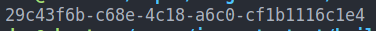

# Basic image to text command line tool
* Tiny command line tool to convert images to text using open CV 4 and Tesseract-ocr
* Only Linux (runs on debian/ubuntu at the moment)

### Dependencies
#### Debian/ubuntu
```bash
sudo apt-get update
sudo apt-get install libopencv-dev
sudo apt-get install libtesseract-dev libleptonica-dev tesseract-ocr
```

### Compile with Cmake or use this:
```bash
g++ -o ocr_image_to_text ocr_image_to_text.cpp -lopencv_core -lopencv_highgui -lopencv_imgproc -ltesseract
```

### Basic example with compiled version
Just run like this from project root:
```bash
cd ./example && ./ocr_image_to_text example_ocr.png
```

Must return exactly the same as the input image:


